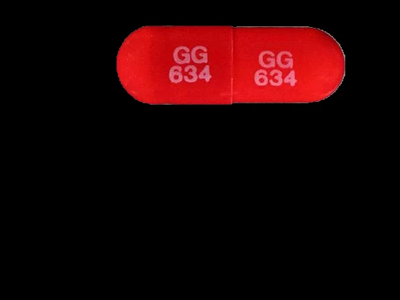
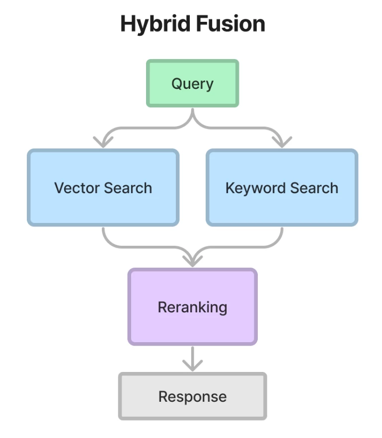

# Advanced Retrieval Augmented Generation (RAG) for Pill Searching

This project was created for the sole educational purpose of explaining how Activeloop and LlamaIndex can be exploited in the Retrieval Augmented Generation (RAG) process. Thanks to the most advanced artificial intelligence techniques, specifically those relating to the NLP field and computer vision, it has been possible to create a common thread between healthcare and RAG techniques.

To run the project it is recommended to create a virtual environment and install the required packages:

Create a new virtual environment

```python
python -m venv venv
```

Activate the virtual environment

```python
source venv/bin/activate
```

Clone this repository

```python
git clone https://github.com/efenocchi/PillSearch-Activeloop.git
```

Clone the FastSAM repository and install its requirements

```python
git clone https://github.com/CASIA-IVA-Lab/FastSAM.git
pip install -r FastSAM/requirements.txt
```

Download FastSAM weights

```python
wget -P FastSAM/weights https://huggingface.co/spaces/An-619/FastSAM/resolve/main/weights/FastSAM.pt
```

Install CLIP

```python
pip install git+https://github.com/openai/CLIP.git
```

Install the project requirements

```python
pip install -r requirements.txt
```

Now that the system has been set up, you can run the Gradio interface.

```python
python gradio_ui.py
```

Here is a short demo showing how the project works:


The goal is to upload a photo of a pill and recognize it. To obtain noteworthy results it was decided to divide the problem into different phases which will be explained in the following paragraphs.

## Segmentation

Initially the image is segmented so that the background does not generate false positives or false negatives, for this phase an algorithm called FastSAM was used.

Here is an example of how segmentation is performed, which will allow the algorithm of the next phase to focus only on the important part of the image:

<div style="display: flex; justify-content: center; gap: 20px;">
    
    
</div>

## Visual Similarity
ResNet-18 is a compelling choice for computing visual similarity between images, such as in our application for identifying similarities between pill images. Its effectiveness lies in its architecture and its capability for feature extraction.
The similarity between these vectors can then be computed using metrics like cosine similarity or Euclidean distance. The closer these vectors are in the feature space, the more similar the images are.
This similarity is performed directly in Activeloop's Deep Lake Vector Stores, simply take the input image and pass it to Activeloop and it will return the `n` most similar images that were found.  If you want to delve deeper into this topic you can find a guide on `Activeloop` at the [following link](https://docs.activeloop.ai/example-code/getting-started/vector-store/step-4-customizing-vector-stores).

## Text Extraction and Identification

In order to extract the text engraved in the pill, purely computer vision approaches were initially used and subsequently GPT-4 vision was chosen.
This SAAS (software as a service) allows us to recover the text present in the pill which will then be compared with those present in the database. If a perfect match occurs, this pill will be identified as the input one, otherwise the closest image will be chosen.

## Gradio Interface

Gradio is an open-source Python library that provides an easy way to create customizable web interfaces for machine learning models. In this pill project, we have utilized Gradio to build a user-friendly interface that allows users to upload pill images and interact with the pipeline.

## Activeloop Visualizer

To show the images returned after the search, the Activeloop rendering engine called Visualizer was used. This functionality allows us to view the data present in the Deep Lake by loading it in HTML format.
It was then possible to embed the Activeloop visualization engine into our RAG applications.


## Advanced Retrieval Strategies

A technique that is becoming increasingly popular in this period is the Retrieval-Augmented Generation (RAG) which enhances large language models (LLMs) by integrating external authoritative knowledge sources beyond their initial training datasets for response generation. LLMs, trained on extensive data and utilizing billions of parameters, excel in tasks such as question answering, language translation, and sentence completion.

### Retriever Phase

Retrievers are responsible for fetching the most relevant context given a user query (or chat message).
It can be built on top of indexes, but can also be defined independently. It is used as a key building block in query engines (and Chat Engines) for retrieving relevant context.

**Vector Store Index**

A VectorStoreIndex is by far the most frequent type of Index you’ll encounter. The Vector Store Index takes your Documents and splits them up into Nodes. It then creates vector embeddings of the text of every node, ready to be queried by an LLM.
The vector store index stores each Node and a corresponding embedding in a Vector Store.


<div align="center"><i><a href="https://docs.llamaindex.ai/en/latest/_images/vector_store.png">Source Image</a></i></div>

Querying a vector store index involves fetching the top-k most similar Nodes, and passing those into our Response Synthesis module.


<div align="center"><i><a href="https://docs.llamaindex.ai/en/latest/_images/vector_store_query.png">Source Image</a></i></div>


**BM25** 

BM25 is a popular ranking function used by search engines to estimate the relevance of documents to a given search query. It's based on probabilistic models and improves upon earlier models like TF-IDF (Term Frequency-Inverse Document Frequency). BM25 considers factors like term frequency and document length to provide a more nuanced approach to relevance scoring. It handles the issue of term saturation (where the importance of a term doesn't always increase linearly with frequency) and length normalization (adjusting scores based on document length to prevent bias toward longer documents). BM25's effectiveness in various search tasks has made it a standard in information retrieval.

### Why do we need to care about different retrieval methods and how are they different from each other?

RAG (Retrieval-Augmented Generation) systems retrieve relevant information from a given knowledge base, thereby allowing it to generate factual, contextually relevant, and domain-specific information. However, RAG faces a lot of challenges when it comes to effectively retrieving relevant information and generating high-quality responses.

Traditional search engines work by parsing documents into chunks and indexing these chunks. The algorithm then searches this index for relevant results based on a user’s query. Retrieval Augmented Generation is a new paradigm in machine learning that uses large language models (LLMs) to improve search and discovery. The LLMs, like the GPT-4, generate relevant content based on context.

The advanced technique utilized in this project is the Hybrid Search. It is a technique that combines multiple search algorithms to improve the accuracy and relevance of search results. It uses the best features of both keyword-based search algorithms with vector search techniques. By leveraging the strengths of different algorithms, it provides a more effective search experience for users.

### Hybrid Fusion Retriever

In advanced technique, we merge the vector store based retriever and the BM25 based retriever. This will enable us to capture both semantic relations and keywords in our input queries.
Since both of these retrievers calculate a score, we can use the reciprocal rerank algorithm to re-sort our nodes without using additional models or excessive computation. We can see the scheme in the image below taken from the LlamaIndex guide:

<div style="display: flex; justify-content: center; gap: 20px;">
    
</div>

## Metrics and Conclusions

Advanced retrievers, like the ones we've been discussing, represent a significant leap in our ability to process and analyze vast amounts of data. These systems, armed with sophisticated algorithms like BM25, vector store, and the latest developments in embedding models from OpenAI, are not just tools; they are gateways to a new era of information accessibility and knowledge discovery.

The power of these retrievers lies in their understanding of context, their ability to sift through massive data sets to find relevant information, and their efficiency in providing accurate results. They have become indispensable in sectors where precision and speed are essential. In the healthcare sector, for example, their application to identify and cross-reference medical information can represent a game changer, improving both the quality of care and patient safety.

All tested models work very well for our use case and in favor of this thesis are the following metrics:

**BM25 Retriever + Re-Ranking technique (classic approach with BM25)**
```text
retrievers  hit_rate    mrr 
top-2 eval  0.964643    0.944501 
```
**Advanced - Hybrid Retriever + Re-Ranking technique with BM25 and the vector retriever**
```text
retrievers  hit_rate    mrr 
top-2 eval  0.975101    0.954078 
```
**Advanced - Hybrid Retriever + Re-Ranking technique with BM25 and the vector retriever and QueryFusionRetriever**
```text
retrievers  hit_rate    mrr 
top-2 eval  0.977138    0.954235 
```

Where the **hit_rate** and **MRR (Mean Reciprocal Rank)** are two metrics commonly used to evaluate the performance of information retrieval systems, search algorithms, and recommendation systems.

**Hit Rate:**
The hit rate is a measure of accuracy, specifically the proportion of times a system successfully retrieves relevant documents or items. It's often used in the context of recommendation systems to evaluate if any of the recommended items are relevant. A hit is usually defined by whether the relevant item appears in the top-N recommendations or retrieval results. For instance, if the system provides 10 recommendations, and at least one of them is relevant, it's considered a hit. The hit rate is the number of hits divided by the total number of recommendations or queries made.

**Mean Reciprocal Rank (MRR):**
MRR is a statistic that measures the average of the reciprocal ranks of results for a sample of queries. The reciprocal rank of a query response is the multiplicative inverse of the rank of the first correct answer. For example, if the first relevant document for a query is located at the third position in a list of ranked items, the reciprocal rank is 1/3. MRR is calculated by taking the average of the reciprocal ranks across all queries. It gives a higher score to systems where the relevant item appears earlier in the recommendation or search results list, therefore considering the ranking of results, unlike hit rate which is binary.

Both metrics are critical for assessing how effectively a system presents the relevant information to users, with the hit rate focusing on presence in the results and MRR on the rank or position of the first relevant result.
