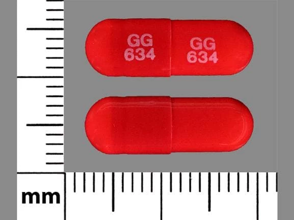
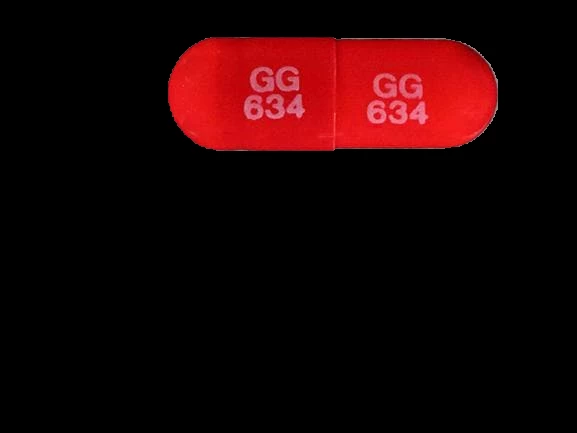
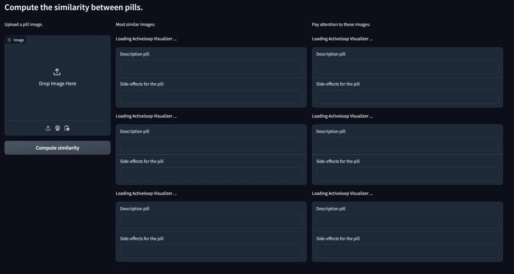
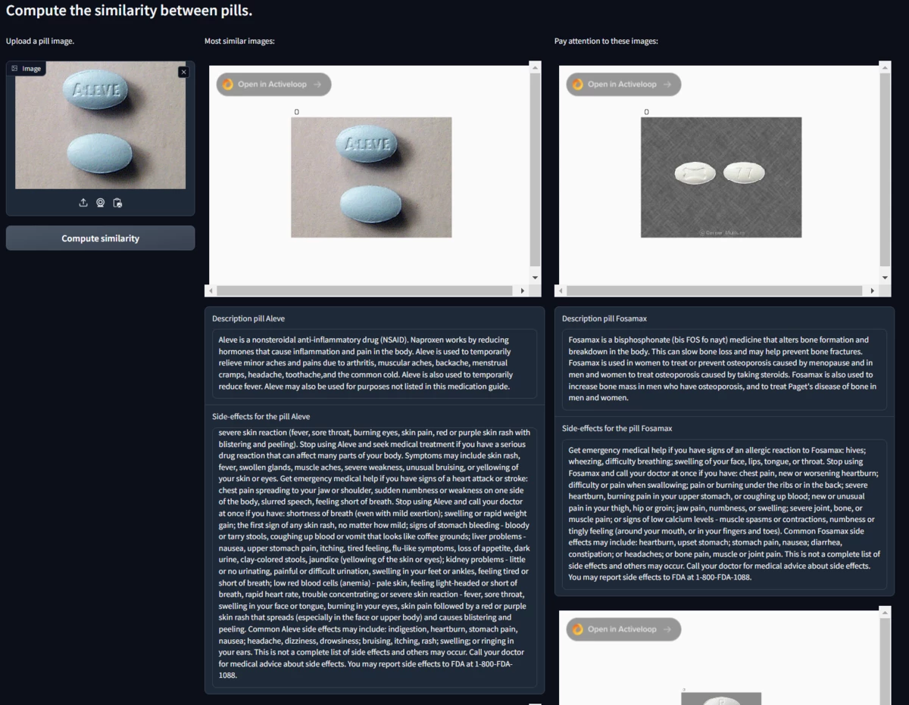

# Advanced Retrieval Augmented Generation (RAG) for Pill Searching

This project exploits the most advanced artificial intelligence techniques, specifically those relating to NLP and computer vision, and is made available to healthcare, allowing the user to take a photo of a pill and find information about it.

The goal is to upload a photo of a pill and recognize it. To obtain noteworthy results it was decided to divide the problem into different phases which will be explained in the following paragraphs.

To run the project you need to follow the steps in the [github repository](https://github.com/efenocchi/PillSearch-Activeloop):

Create a new virtual environment

```python
python -m venv venv
```

Activate the virtual environment

```python
source venv/bin/activate
```

Clone the project repository

```python
git clone https://github.com/efenocchi/PillSearch-Activeloop.git
```

Clone the FastSAM repository and install its requirements

```python
git clone https://github.com/CASIA-IVA-Lab/FastSAM.git
pip install -r FastSAM/requirements.txt
```

Download FastSAM weights

```python
wget -P FastSAM/weights https://huggingface.co/spaces/An-619/FastSAM/resolve/main/weights/FastSAM.pt
```

Install CLIP

```python
pip install git+https://github.com/openai/CLIP.git
```

Install the project requirements

```python
pip install -r requirements.txt
```

Don't forget to set the API tokens as global variables by placing them in the .env file or passing them into the CLI using the `--credentials` argument.

Now that the system has been set up, you can run the Gradio interface.

```python
python gradio_app.py
```

## Segmentation

Initially the image is segmented so that the background does not generate false positives or false negatives, for this phase an algorithm called FastSAM was used. This algorithm is able to perform well on both GPU and CPU and has some characteristics to consider:

- **Real-time Solution:** FastSAM capitalizes on the computational prowess of Convolutional Neural Networks (CNNs) to offer a real-time solution for the 'segment anything' task. This feature is particularly beneficial for industrial applications where swift and efficient results are paramount.
- **Practical Applications:** FastSAM introduces a novel and practical approach for a wide array of vision tasks, delivering results at a speed that is tens to hundreds of times faster than existing methods, revolutionizing the field.
- **Based on YOLOv8-seg:** At its core, FastSAM utilizes YOLOv8-seg, a sophisticated object detector with an integrated instance segmentation branch, enabling it to efficiently generate segmentation masks for all instances in an image.
- **Efficiency and Performance:** FastSAM stands out by dramatically lowering computational and resource usage while maintaining high-quality performance. It rivals the performance of SAM but requires substantially

Here is an example of how segmentation is performed, which will allow the algorithm of the next phase to focus only on the important part of the image:

<div style="display: flex; justify-content: center; gap: 20px;">
    
    
</div>

After performing the segmentation, we examine which image in our dataset is similar to the one we just segmented. This practice is performed via a neural network called ResNet-18 and allows you to capture important image information and use it in the similarity search phase.

It is important to underline that even the images of the dataset that are being compared were all initially segmented to avoid the problem described above.

If you want to know more about how this technique works you can read the article [ResNet-18 from Deep Residual Learning for Image Recognition](https://arxiv.org/abs/1512.03385).

## Visual Similarity
ResNet-18 is a compelling choice for computing visual similarity between images, such as in our application for identifying similarities between pill images. Its effectiveness lies in its architecture and its capability for feature extraction. Here's a breakdown of why ResNet-18 is well-suited for this task:

- **Deep Residual Learning:** ResNet-18, a variant of the Residual Network (ResNet) family, incorporates deep residual learning. In ResNet-18, there are 18 layers, including convolutional layers, batch normalization, ReLU activations, and fully connected layers.
- **Feature Extraction:** One of the primary strengths of ResNet-18 is its feature extraction capability. In the context of pill images, ResNet-18 can learn and identify intricate patterns, shapes, and colors that are unique to different pills. During the forward pass, as the image goes through successive layers, the network learns hierarchically more complex and abstract features. Initial layers might detect edges or basic shapes, while deeper layers can identify more specific features relevant to different types of pills.
- **Efficiency and Speed:** Despite being deep, ResNet-18 is relatively lightweight compared to other deeper models (like ResNet-50 or ResNet-101). This makes it a good choice for applications where computational resources or inference time might be a concern, without significantly compromising on the accuracy of feature extraction.
- **Performance in Feature Embedding:** For tasks like visual similarity, it's essential to have a robust feature embedding, which is a compressed representation of the input image. ResNet-18, due to its deep structure, can create rich, discriminative embeddings. When we input two pill images, ResNet-18 processes them to produce feature vectors.

The similarity between these vectors can then be computed using metrics like cosine similarity or Euclidean distance. The closer these vectors are in the feature space, the more similar the images are.

This similarity is performed directly in Activeloop's Deep Lake Vector Stores, simply take the input image and pass it to Activeloop and it will return the `n` most similar images that were found.  If you want to delve deeper into this topic you can find a guide on `Activeloop` [here](https://docs.activeloop.ai/example-code/getting-started/vector-store/step-4-customizing-vector-stores).

Going into a little more detail in this project we can see how visual similarity search is not the only one that has been used. Once the `n` most similar images have been returned they are split into two groups: 
- the `3` most similar images 
- the remaining `n - 3` images

To talk about the second type of similarity we take an intermediate step and show what the user interface looks like.

## Text Extraction and Identification

In order to extract the text engraved in the pill, purely computer vision approaches were initially used and subsequently GPT-4 vision was chosen.
This SAAS (software as a service) allows us to recover the text present in the pill which will then be compared with those present in the database. If a perfect match occurs, this pill will be identified as the input one, otherwise the closest image will be chosen.

## Gradio Interface

Gradio is an open-source Python library that provides an easy way to create customizable web interfaces for machine learning models. In this pill project, we have utilized Gradio to build a user-friendly interface that allows users to upload pill images and interact with the pipeline.

The results are then displayed back to the user through the Gradio interface and are divided into two different columns:

- in the first there are the `3 images` most similar to the input one 
- in the second there are `3 similar images` to which we must pay attention because they have a description of the pill as different as possible from the one inserted.

It is necessary to specify that since the input image has no text but is just an image, the description taken is that of the image whose unique identification code is equal to one of those present in the dataset or, in case there is no exact match, that of the image which is absolutely most similar to the input one.

The interface that the user will initially load is as follows:



## Activeloop Visualizer

To show the images returned after the search, the Activeloop rendering engine called Visualizer was used. This functionality allows us to view the data present in the Deep Lake by loading it in HTML format.
It was then possible to embed the Activeloop visualization engine into our RAG applications.




In this case for each cell we chose to return only the image we needed but if desired it is possible to view all the images in a single window and move between them using the cursor.

If you want to delve deeper into this functionality and integrate it into your application via Python or Javascript code you can find the guide [here](https://docs.activeloop.ai/technical-details/visualizer-integration).

Now we can move on to the last phase, the similarity search via description of the pill.

## Advanced Retrieval Strategies

A technique that is becoming increasingly popular in this period is the Retrieval-Augmented Generation (RAG) which enhances large language models (LLMs) by integrating external authoritative knowledge sources beyond their initial training datasets for response generation. LLMs, trained on extensive data and utilizing billions of parameters, excel in tasks such as question answering, language translation, and sentence completion.

RAG builds upon these strengths, tailoring LLMs to particular domains or aligning them with an organization's internal knowledge, without necessitating model retraining. This method provides a cost-efficient solution to refine LLM outputs, ensuring their continued relevance, precision, and utility across diverse applications.

There are five key stages within RAG, which in turn will be a part of any larger application you build. These are:

- **Loading:** This involves transferring data from its original location, such as text files, PDFs, websites, databases, or APIs, into your processing pipeline. LlamaHub offers a wide range of connectors for this purpose.

- **Indexing:** This process entails developing a data structure that supports data querying. In the context of LLMs, it typically involves creating vector embeddings, which are numerical representations of your data's meaning, along with various metadata strategies to facilitate the accurate retrieval of contextually relevant data.

- **Storing:** After indexing, it's common practice to store the index and other metadata. This step prevents the need for re-indexing in the future.

- **Querying:** Depending on the chosen indexing method, there are multiple ways to deploy LLMs and LlamaIndex structures for querying, including options like sub-queries, multi-step queries, and hybrid approaches.

- **Evaluation:** This crucial phase in the pipeline assesses its effectiveness against other methods or following modifications. Evaluation provides objective metrics of the accuracy, reliability, and speed of your system's responses to queries.

These processes can be easily and clearly represented by the following diagram in the LLamaIndex guide:


Since we have a description for each pill we used these descriptions as if they were documents in order to then be able to obtain the most similar ones (and therefore also the least similar ones) once the description of the input pill was passed to the model.

After initially loading our data onto Activeloop's Deep Lake we can show how the data present in this space is used to do an Advanced Retrieval.

```python
from llama_index.vector_stores import DeepLakeVectorStore
from typing import Optional, Union
def create_upload_vectore_store(
    chunked_text: list,
    vector_store_path: Union[str, os.PathLike],
    filename: str,
    metadata: Optional[list[dict]] = None,
):
    vector_store = DeepLakeVectorStore(
        dataset_path=vector_store_path,
        runtime={"tensor_db": True},
        overwrite=True,
        tensor_params=[
            {"name": "text", "htype": "text"},
            {"name": "embedding", "htype": "embedding"},
            {"name": "filename", "htype": "text"},
            {"name": "metadata", "htype": "json"},
        ],
    )
    vector_store = vector_store.vectorstore
    vector_store.add(
        text=chunked_text,
        embedding_function=embedding_function_text,
        filename=filename,
        embedding_data=chunked_text,
        rate_limiter={
            "enabled": True,
            "bytes_per_minute": 1500000,
            "batch_byte_size": 10000,
        },
        metadata=metadata if metadata else None,
    )
```

For all subsequent steps we used LlamaIndex which is a data framework for LLM-based applications used to capture, structure and access private or domain-specific data.

### Indexing Phase
 Once we’ve ingested the data, LlamaIndex will help us index the data into a structure that’s easy to retrieve. This involves generating vector embeddings which are stored in a specialized database called a vector store, in our case we stored them into the Deep Lake Vector Store. Indexes can also store a variety of metadata about your data.

Under the hood, Indexes store data in Node objects (which represent chunks of the original documents), and expose a Retriever interface that supports additional configuration and automation.

This part is made up of two main blocks:
- **Embedding**: we used OpenAI's `text-embedding-ada-002` as the embedding model
- **Retriever**: we tried different approaches which will be described below

### Retriever Phase

Retrievers are responsible for fetching the most relevant context given a user query (or chat message).
It can be built on top of indexes, but can also be defined independently. It is used as a key building block in query engines (and Chat Engines) for retrieving relevant context.

**Vector Store Index**

A VectorStoreIndex is by far the most frequent type of Index you’ll encounter. The Vector Store Index takes your Documents and splits them up into Nodes. It then creates vector embeddings of the text of every node, ready to be queried by an LLM.
The vector store index stores each Node and a corresponding embedding in a Vector Store.


<div align="center"><i><a href="https://docs.llamaindex.ai/en/latest/_images/vector_store.png">Source Image</a></i></div>

Querying a vector store index involves fetching the top-k most similar Nodes, and passing those into our Response Synthesis module.


<div align="center"><i><a href="https://docs.llamaindex.ai/en/latest/_images/vector_store_query.png">Source Image</a></i></div>


**BM25** 

BM25 is a popular ranking function used by search engines to estimate the relevance of documents to a given search query. It's based on probabilistic models and improves upon earlier models like TF-IDF (Term Frequency-Inverse Document Frequency). BM25 considers factors like term frequency and document length to provide a more nuanced approach to relevance scoring. It handles the issue of term saturation (where the importance of a term doesn't always increase linearly with frequency) and length normalization (adjusting scores based on document length to prevent bias toward longer documents). BM25's effectiveness in various search tasks has made it a standard in information retrieval.

To use this retriever we need to take documents from Activeloop's Deep Lake and transform them into nodes, these nodes will then be returned in an orderly manner once a question is asked. This process, as already mentioned previously, exploits the similarity between the description of the pill (which will be passed as a query) and the description of the `n - 3` most similar pills.

In the code below we used the name of the images to make a specific query that returned only the values ​​of those images and by extrapolating their description we created the nodes and indexes.

```python
def get_index_and_nodes_after_visual_similarity(filenames: list):
    vector_store = load_vector_store(vector_store_path=VECTOR_STORE_PATH_DESCRIPTION)

    conditions = " or ".join(f"filename == '{name}'" for name in filenames)
    tql_query = f"select * where {conditions}"

    filtered_elements = vector_store.vectorstore.search(query=tql_query)
    chunks = []
    for el in filtered_elements["text"]:
        chunks.append(el)

    string_iterable_reader = download_loader("StringIterableReader")
    loader = string_iterable_reader()
    documents = loader.load_data(texts=chunks)
    node_parser = SimpleNodeParser.from_defaults(separator="\n")
    nodes = node_parser.get_nodes_from_documents(documents)

    # To ensure same id's per run, we manually set them.
    for idx, node in enumerate(nodes):
        node.id_ = f"node_{idx}"

    llm = OpenAI(model="gpt-4")

    service_context = ServiceContext.from_defaults(llm=llm)
    index = VectorStoreIndex(nodes=nodes)
    return index, nodes, service_context, filtered_elements
```

Since we have the `n` most similar images (obtained in the previous step through the visual similarity), we can extract the description of these `n` images and use them to generate the nodes.

### Why do we need to care about different retrieval methods and how are they different from each other?

RAG (Retrieval-Augmented Generation) systems retrieve relevant information from a given knowledge base, thereby allowing it to generate factual, contextually relevant, and domain-specific information. However, RAG faces a lot of challenges when it comes to effectively retrieving relevant information and generating high-quality responses.

Traditional search engines work by parsing documents into chunks and indexing these chunks. The algorithm then searches this index for relevant results based on a user’s query. Retrieval Augmented Generation is a new paradigm in machine learning that uses large language models (LLMs) to improve search and discovery. The LLMs, like the GPT-4, generate relevant content based on context.

The advanced technique utilized in this project is the Hybrid Search. It is a technique that combines multiple search algorithms to improve the accuracy and relevance of search results. It uses the best features of both keyword-based search algorithms with vector search techniques. By leveraging the strengths of different algorithms, it provides a more effective search experience for users.

### Hybrid Fusion Retriever

In advanced technique, we merge the vector store based retriever and the BM25 based retriever. This will enable us to capture both semantic relations and keywords in our input queries.
Since both of these retrievers calculate a score, we can use the reciprocal rerank algorithm to re-sort our nodes without using additional models or excessive computation. We can see the scheme in the image below taken from the LlamaIndex guide:

<div style="display: flex; justify-content: center; gap: 20px;">
    
</div>

### BM25 Retriever + Re-Ranking technique (classic approach with BM25)


In this first case we use a classic retriever based only on the **BM25 retriever**, the nodes generated by the query will then be re-ranked and filtered. This allows us to keep the intermediate top-k values ​​large and filter out unnecessary nodes.

```python
_, nodes, service_context = get_index_and_nodes_from_activeloop(
    vector_store_path=VECTOR_STORE_PATH_BASELINE
)
```

These nodes will then be used by the bm25 retriever. It is useful to note that the index variable is not currently used because bm25 manages this entire part internally.

```python
bm25_retriever = BM25Retriever.from_defaults(nodes=nodes, similarity_top_k=10)
```

Now that we have the nodes we need to obtain the similarity by passing the description of the input image as a query.

```python
nodes_bm25_response = bm25_retriever.retrieve(description)
```

ClassicRetrieverBM25 is an object that we used to manage the creation of the BM25-based retriever in a more orderly way.

```python
class ClassicRetrieverBM25(BaseRetriever):
    def __init__(self, bm25_retriever):
        self.bm25_retriever = bm25_retriever
        super().__init__()

    def _retrieve(self, query, **kwargs):
        bm25_nodes = self.bm25_retriever.retrieve(query, **kwargs)
        all_nodes = []
        node_ids = set()
        for n in bm25_nodes:
            if n.node.node_id not in node_ids:
                all_nodes.append(n)
                node_ids.add(n.node.node_id)
        return all_nodes
```

The final part of this process is generated by the re-renker which takes care of ordering the nodes according to their score.

```python
reranker = SentenceTransformerRerank(top_n=4, model="BAAI/bge-reranker-base")

# nodes retrieved by the bm25 retriever with the reranker
reranked_nodes_bm25 = reranker.postprocess_nodes(
    nodes_bm25_response,
    query_bundle=QueryBundle(QUERY),
)
```

### Advanced - Hybrid Retriever + Re-Ranking technique with BM25 and the vector retriever 

Here we extend the base retriever class and create a custom retriever that always uses the **vector retriever** and **BM25 retreiver**. In this test, the previous approach was used but the vector store was added as a retriever which uses the index variable returned by the `get_index_and_nodes_after_visual_similarity` function to manage the nodes.

At the beginning, we create the standard retriever:

```python
index, nodes, _ = get_index_and_nodes_from_activeloop(
    vector_store_path=VECTOR_STORE_PATH_COMPLETE_SEQUENTIALLY
)
self.vector_retriever = index.as_retriever(similarity_top_k=2)
self.bm25_retriever = BM25Retriever.from_defaults(
    nodes=nodes, similarity_top_k=10
)
```

The nodes will then be calculated both via the vector store and bm25 and once they are all put together they will be re-ranked and filtered. This process allows us to get the best of both models and filter out the `k best nodes`.

```python
reranked_nodes_bm25 = self.reranker.postprocess_nodes(
        self.nodes_bm25_response,
        query_bundle=QueryBundle(QUERY),
    )
print("Reranked Nodes BM25\n\n")
for el in reranked_nodes_bm25:
    print(f"{el.score}\n")

reranked_nodes_vector = self.reranker.postprocess_nodes(
self.nodes_vector_response,
query_bundle=QueryBundle(QUERY),
)
print("Reranked Nodes Vector\n\n")
for el in reranked_nodes_vector:
    print(f"{el.score}\n")
    unique_nodes = keep_best_k_unique_nodes(
        reranked_nodes_bm25, reranked_nodes_vector
    )
    print("Unique Nodes\n\n")
for el in unique_nodes:
    print(f"{el.id} : {el.score}\n")
```
### Advanced - Hybrid Retriever + Re-Ranking technique with BM25 and the vector retriever and QueryFusionRetriever

In the last case we can see how through the QueryFusionRetriever object the entire process described previously can be represented with a single function.

We fuse our index with a BM25 based retriever, this will enable us to capture both semantic relations and keywords in our input queries.

Since both of these retrievers calculate a score, we can use the reciprocal rerank algorithm to re-sort our nodes without using an additional models or excessive computation.

```python
from llama_index.retrievers import BM25Retriever

vector_retriever = index.as_retriever(similarity_top_k=2)

bm25_retriever = BM25Retriever.from_defaults(
    docstore=index.docstore, similarity_top_k=2
)
```

Here we can create our fusion retriever, which will return the top-2 most similar nodes from the 4 returned nodes from the retrievers:

```python
from llama_index.retrievers import QueryFusionRetriever

retriever = QueryFusionRetriever(
    [vector_retriever, bm25_retriever],
    similarity_top_k=2,
    num_queries=4,  # set this to 1 to disable query generation
    mode="reciprocal_rerank",
    use_async=True,
    verbose=True,
)
```

Finally, we can perform the query search:

```python
retriever.retrieve(description)
```

## Metrics and Conclusions

Advanced retrievers, like the ones we've been discussing, represent a significant leap in our ability to process and analyze vast amounts of data. These systems, armed with sophisticated algorithms like BM25, vector store, and the latest developments in embedding models from OpenAI, are not just tools; they are gateways to a new era of information accessibility and knowledge discovery.

The power of these retrievers lies in their understanding of context, their ability to sift through massive data sets to find relevant information, and their efficiency in providing accurate results. They have become indispensable in sectors where precision and speed are essential. In the healthcare sector, for example, their application to identify and cross-reference medical information can represent a game changer, improving both the quality of care and patient safety.

All tested models work very well for our use case and in favor of this thesis are the following metrics:

**BM25 Retriever + Re-Ranking technique (classic approach with BM25)**
```text
retrievers  hit_rate    mrr 
top-2 eval  0.964643    0.944501 
```
**Advanced - Hybrid Retriever + Re-Ranking technique with BM25 and the vector retriever**
```text
retrievers  hit_rate    mrr 
top-2 eval  0.975101    0.954078 
```
**Advanced - Hybrid Retriever + Re-Ranking technique with BM25 and the vector retriever and QueryFusionRetriever**
```text
retrievers  hit_rate    mrr 
top-2 eval  0.977138    0.954235 
```

Where the **hit_rate** and **MRR (Mean Reciprocal Rank)** are two metrics commonly used to evaluate the performance of information retrieval systems, search algorithms, and recommendation systems.

**Hit Rate:**
The hit rate is a measure of accuracy, specifically the proportion of times a system successfully retrieves relevant documents or items. It's often used in the context of recommendation systems to evaluate if any of the recommended items are relevant. A hit is usually defined by whether the relevant item appears in the top-N recommendations or retrieval results. For instance, if the system provides 10 recommendations, and at least one of them is relevant, it's considered a hit. The hit rate is the number of hits divided by the total number of recommendations or queries made.

**Mean Reciprocal Rank (MRR):**
MRR is a statistic that measures the average of the reciprocal ranks of results for a sample of queries. The reciprocal rank of a query response is the multiplicative inverse of the rank of the first correct answer. For example, if the first relevant document for a query is located at the third position in a list of ranked items, the reciprocal rank is 1/3. MRR is calculated by taking the average of the reciprocal ranks across all queries. It gives a higher score to systems where the relevant item appears earlier in the recommendation or search results list, therefore considering the ranking of results, unlike hit rate which is binary.

Both metrics are critical for assessing how effectively a system presents the relevant information to users, with the hit rate focusing on presence in the results and MRR on the rank or position of the first relevant result.
